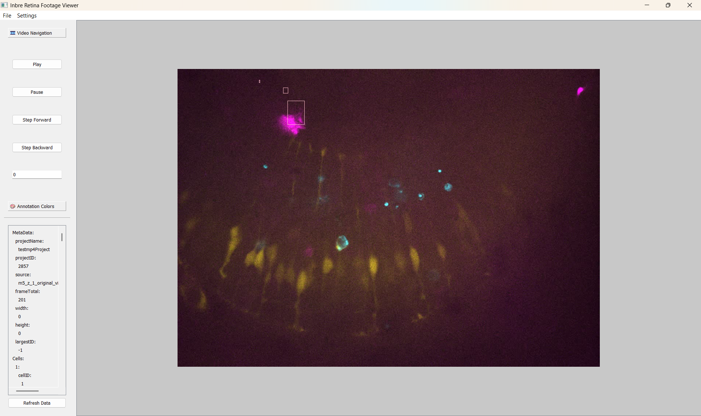

# About the project
This applicaiton is an annotation video viewer. Designed to provide a way to view annotations made for images or videos of fish retinas. Currently only mp4's, jpegs, and pngs are accepted formats.

# Accepted project structure
The application opens project folders that contain at least two files with all the needed data to render the given media and its associated. The first file is the annotations file. This file is a json file that contains all the data needed to render the annotations such as metadata, cells, cell types, events, event types, and lastly annotations (the actual drawn contours that define the cell boundries). The second file is kept in a secondary source directory where the media source is stored for reference during media display or playback.

# Annotations file structure
The annotations.json file has a specific structure that mimicks the basic datastructures the applicaiton uses while in use, that is strings, integers, booleans,  lists, and dicitonaries.